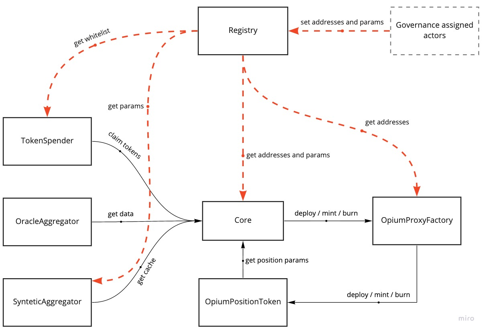

# Opium protocol v2

Opium v2 is a permissionless financial smart escrow protocol that allows its users to create fully customizable financial products. Its primary use-case is the management of derivatives, which are represented as a pair of LONG and SHORT ERC20 Opium position tokens. As a financial engineer, you can easily create a derivative contract with Opium v2 and be rewarded a portion of the reserves accrued by the protocol for each successful settlement of your own financial products. As a seller and buyer, you can partake in (for example) PUT or CALL options on an underlying by holding a specific Opium position token, you can exchange them on an AMM, exercise them at expiry or redeem them for initial margin if you hold an equal amount of LONG and SHORT positions. The focus of the design is to be as lean as possible as to enable the greatest flexibility and interoperability with other financial primitives.



## Deployment Addresses

### Mainnet

#### Arbitrum
| Contract            | Proxy                                      | Implementation                             |
|---------------------|--------------------------------------------|--------------------------------------------|
| Registry            | [0x17b6ffe276e8A4a299a5a87a656aFc5b8FA3ee4a](https://arbiscan.io/address/0x17b6ffe276e8A4a299a5a87a656aFc5b8FA3ee4a) | [0x845a7872d1cDe2B3285dE9f66B1D2EC70307cC6b](https://arbiscan.io/address/0x845a7872d1cDe2B3285dE9f66B1D2EC70307cC6b) |
| Core                | [0x1497A23a2abC0DAFFb8e333183cfC181b24bB570](https://arbiscan.io/address/0x1497A23a2abC0DAFFb8e333183cfC181b24bB570) | [0x5854694204828385ED3d5B9d0FF912794D78cdaE](https://arbiscan.io/address/0x5854694204828385ED3d5B9d0FF912794D78cdaE) |
| TokenSpender        | [0x0A9A6CD7485Dd77c6cec28FB1bd64D5969B79132](https://arbiscan.io/address/0x0A9A6CD7485Dd77c6cec28FB1bd64D5969B79132) | [0x7C78bfaDb7F0EA6E84CC5196B6fAC48fb1cFA34E](https://arbiscan.io/address/0x7C78bfaDb7F0EA6E84CC5196B6fAC48fb1cFA34E) |
| OpiumProxyFactory   | [0x328bC74ccA6578349B262D21563d5581DAA43a16](https://arbiscan.io/address/0x328bC74ccA6578349B262D21563d5581DAA43a16) | [0x5a608F8dfD67504Eb1F07D0b32ACD8753160fCA3](https://arbiscan.io/address/0x5a608F8dfD67504Eb1F07D0b32ACD8753160fCA3) |
| OpiumPositionToken  | -                                          | [0x6384f8070fda183e2b8ce0d521c0a9e7606e30ea](https://arbiscan.io/address/0x6384f8070fda183e2b8ce0d521c0a9e7606e30ea) |
| OracleAggregator    | [0x85d9c3784B277Bc10e1504Aa8f647132ba17A674](https://arbiscan.io/address/0x85d9c3784B277Bc10e1504Aa8f647132ba17A674) | [0xC3e733eaCCD9c3bc54450aCe8074F589760Ae079](https://arbiscan.io/address/0xC3e733eaCCD9c3bc54450aCe8074F589760Ae079) |
| SyntheticAggregator | [0xE6AFB8b01CAF0214706116c7Dc3B978E6eb8ce7e](https://arbiscan.io/address/0xE6AFB8b01CAF0214706116c7Dc3B978E6eb8ce7e) | [0xbd0e3097F47cEcA12407bAc42cDD574cf3072F23](https://arbiscan.io/address/0xbd0e3097F47cEcA12407bAc42cDD574cf3072F23) |
| ProxyAdmin          | -                                          | [0x2ba5fee02489c4c7d550b82044742084a652f01a](https://arbiscan.io/address/0x2ba5fee02489c4c7d550b82044742084a652f01a) |

##### Helpers
| Contract             | Address                                      |
|----------------------|--------------------------------------------|
| BalanceHelper        | [0x2f92AE7f568c1Fe3379eE47Daa7819E1362bf25d](https://arbiscan.io/address/0x2f92AE7f568c1Fe3379eE47Daa7819E1362bf25d) |
| PayoutHelper         | [0x06eb4bCc14b8C1664a2d4e2CdE8fA2F992332fCd](https://arbiscan.io/address/0x06eb4bCc14b8C1664a2d4e2CdE8fA2F992332fCd) |
| OnChainPositionsLens | [0xfa01Fd6118445F811753D96178F2ef8AE77caa53](https://arbiscan.io/address/0xfa01Fd6118445F811753D96178F2ef8AE77caa53) |
### Testnet

#### Arbitrum Testnet
| Contract            | Proxy                                      | Implementation                             |
|---------------------|--------------------------------------------|--------------------------------------------|
| Registry            | [0x9285CAA6F92D9Ba197966E854174e9B27B2061e5](https://testnet.arbiscan.io/address/0x9285CAA6F92D9Ba197966E854174e9B27B2061e5) | [0x48ccef1ecc69e0b5e5fd3340c15f9a2e18563022](https://testnet.arbiscan.io/address/0x48ccef1ecc69e0b5e5fd3340c15f9a2e18563022) |
| Core                | [0x416d29de99e346c59100680a14d44De08891dE30](https://testnet.arbiscan.io/address/0x416d29de99e346c59100680a14d44De08891dE30) | [0x384a5683155f035200cb16fbed0aedb2a6ffaf37](https://testnet.arbiscan.io/address/0x384a5683155f035200cb16fbed0aedb2a6ffaf37) |
| TokenSpender        | [0xdFDe0C087DF52627673043a86E657B927ee10c4b](https://testnet.arbiscan.io/address/0xdFDe0C087DF52627673043a86E657B927ee10c4b) | [0xaC7C9f40F404Df8f5c0436087b7E9e7b0735f90b](https://testnet.arbiscan.io/address/0xaC7C9f40F404Df8f5c0436087b7E9e7b0735f90b) |
| OpiumProxyFactory   | [0x3ea7753bE2d0ab682cd0f0B8803f3331BC5230fc](https://testnet.arbiscan.io/address/0x3ea7753bE2d0ab682cd0f0B8803f3331BC5230fc) | [0x5C97c97ea1015E4f2aE4274c022A06957Eddbb46](https://testnet.arbiscan.io/address/0x5C97c97ea1015E4f2aE4274c022A06957Eddbb46) |
| OpiumPositionToken  | -                                          | [0x7b006dfca781aee11b4a4e9f42c3239ecd4dcf39](https://testnet.arbiscan.io/address/0x7b006dfca781aee11b4a4e9f42c3239ecd4dcf39) |
| OracleAggregator    | [0xd030051cd8Cc0760fb0Fa857bbFDb8f9C3dAcaDE](https://testnet.arbiscan.io/address/0xd030051cd8Cc0760fb0Fa857bbFDb8f9C3dAcaDE) | [0x5f1670bdbafcbea39579083dfd56984bb4a34d25](https://testnet.arbiscan.io/address/0x5f1670bdbafcbea39579083dfd56984bb4a34d25) |
| SyntheticAggregator | [0x3c1150e52d028DCD67a0bA986D332D54A8baC29A](https://testnet.arbiscan.io/address/0x3c1150e52d028DCD67a0bA986D332D54A8baC29A) | [0x01A44DbFE8a2b9568BEA0C0Db938E0dF93682910](https://testnet.arbiscan.io/address/0x01A44DbFE8a2b9568BEA0C0Db938E0dF93682910) |
| ProxyAdmin          | -                                          | [0xFcEAF12d8A38E1135124E4251A462bA92F22b172](https://testnet.arbiscan.io/address/0xFcEAF12d8A38E1135124E4251A462bA92F22b172) |

##### Helpers
| Contract             | Address                                      |
|----------------------|--------------------------------------------|
| BalanceHelper        | [0x60682B5B1C0AA76c0104AE77CCBFfbE95cE9Bc8a](https://testnet.arbiscan.io/address/0x60682B5B1C0AA76c0104AE77CCBFfbE95cE9Bc8a) |
| PayoutHelper         | [0x42A02e1CC96974834Bd1eB2C02D34f68853Bb305](https://testnet.arbiscan.io/address/0x42A02e1CC96974834Bd1eB2C02D34f68853Bb305) |
| OnChainPositionsLens | [0x4b214B8AaFBdeB170b550Bb2dfed41AadD9aCf74](https://testnet.arbiscan.io/address/0x4b214B8AaFBdeB170b550Bb2dfed41AadD9aCf74) |

#### Polygon (Mumbai) Testnet
| Contract            | Proxy                                      | Implementation                             |
|---------------------|--------------------------------------------|--------------------------------------------|
| Registry            | [0x9285CAA6F92D9Ba197966E854174e9B27B2061e5](https://mumbai.polygonscan.com/address/0x9285CAA6F92D9Ba197966E854174e9B27B2061e5) | [0x7C40069bdC198925007786414343681bceCFd91D](https://mumbai.polygonscan.com/address/0x7C40069bdC198925007786414343681bceCFd91D) |
| Core                | [0x416d29de99e346c59100680a14d44De08891dE30](https://mumbai.polygonscan.com/address/0x416d29de99e346c59100680a14d44De08891dE30) | [0x8d4129b538EEdaD7169ff53dd710E152eab9eB4B](https://mumbai.polygonscan.com/address/0x8d4129b538EEdaD7169ff53dd710E152eab9eB4B) |
| TokenSpender        | [0xdFDe0C087DF52627673043a86E657B927ee10c4b](https://mumbai.polygonscan.com/address/0xdFDe0C087DF52627673043a86E657B927ee10c4b) | [0xa370CF1BB01e368FFdDB81A6511E6Ef072131A77](https://mumbai.polygonscan.com/address/0xa370CF1BB01e368FFdDB81A6511E6Ef072131A77) |
| OpiumProxyFactory   | [0x3ea7753bE2d0ab682cd0f0B8803f3331BC5230fc](https://mumbai.polygonscan.com/address/0x3ea7753bE2d0ab682cd0f0B8803f3331BC5230fc) | [0x30654f4145A67345CF1B701eac259aA7a2e06FE7](https://mumbai.polygonscan.com/address/0x30654f4145A67345CF1B701eac259aA7a2e06FE7) |
| OpiumPositionToken  | -                                          | [0x7b006dfca781aee11b4a4e9f42c3239ecd4dcf39](https://mumbai.polygonscan.com/address/0x7b006dfca781aee11b4a4e9f42c3239ecd4dcf39) |
| OracleAggregator    | [0xd030051cd8Cc0760fb0Fa857bbFDb8f9C3dAcaDE](https://mumbai.polygonscan.com/address/0xd030051cd8Cc0760fb0Fa857bbFDb8f9C3dAcaDE) | [0x5F1670bdbAfcbEA39579083Dfd56984bb4A34d25](https://mumbai.polygonscan.com/address/0x5F1670bdbAfcbEA39579083Dfd56984bb4A34d25) |
| SyntheticAggregator | [0x3c1150e52d028DCD67a0bA986D332D54A8baC29A](https://mumbai.polygonscan.com/address/0x3c1150e52d028DCD67a0bA986D332D54A8baC29A) | [0xF69821f7364FFc154E4a5003794EE2D9F40FD8Cc](https://mumbai.polygonscan.com/address/0xF69821f7364FFc154E4a5003794EE2D9F40FD8Cc) |
| ProxyAdmin          | -                                          | [0xFcEAF12d8A38E1135124E4251A462bA92F22b172](https://mumbai.polygonscan.com/address/0xFcEAF12d8A38E1135124E4251A462bA92F22b172) |

##### Helpers
| Contract             | Address                                      |
|----------------------|--------------------------------------------|
| BalanceHelper        | [0xBd7C4B9aB1AC188E11CA046a996e378ecBB2a031](https://mumbai.polygonscan.com/address/0xBd7C4B9aB1AC188E11CA046a996e378ecBB2a031) |
| PayoutHelper         | [0x0D4168f4e87C391D2A92264841106140bc12FE02](https://mumbai.polygonscan.com/address/0x0D4168f4e87C391D2A92264841106140bc12FE02) |
| OnChainPositionsLens | [0x1e700c04c9F7c9d6c92F0B1a50dAf103b09E5821](https://mumbai.polygonscan.com/address/0x1e700c04c9F7c9d6c92F0B1a50dAf103b09E5821) |

## Local Development Setup and initialization

#### Clone repo and install dependencies

The setup assumes that you have:

- Node.js ^14.5
- Yarn

Clone the project and install all dependencies:

```sh
$ git clone git@github.com:OpiumProtocol/opium-protocol-v2.git
$ cd opium-protocol-v2

# install project dependencies
$ yarn install
```

#### Set environment variables

You need to set the environment variable values. Unless you want to deploy the project on a network, the only important value here is the mnemonic as it is used to deterministically generate the accounts used for the tests. Set the following variables on the `.env` file on the root level of the repository:

```sh
touch .env
```

```sh
ETHERSCAN_KEY: "abc"
BSCSCAN_API_KEY: "abc"
BSC_MAINNET_ENDPOINT: "abc"
POLYGON_MAINNET_ENDPOINT: "abc"
INFURA_API_KEY: "abc"
MNEMONIC: "test test test test test test test test test test test junk"
HARDHAT_NETWORK_ENVIRONMENT='local'
```

Note that to run the tests that require a mainnnet fork, it is required to change the HARDHAT_NETWORK_ENVIRONMENT variable as follows:

```sh
HARDHAT_NETWORK_ENVIRONMENT='fork'
```

#### Deployment on a local hardhat network and initialization

```sh
yarn deploy
```

The above command runs the deployment fixtures in `deploy/index.ts`. \
The steps performed are the following:

- Deploys contracts defined in the Protocol fixtures (deploy/index.ts)
- After successful deployment, all the Protocol addresses (OpiumProxyFactory, Core, OracleAggregator, SyntheticAggregator, TokenSpender) and the protocol’s reserves receivers (named protocolExecutionReserveClaimer and protocolRedemptonReserveClaimer) should be stored in the Registry contract
- After successful registration, the core contract should be added to the whitelist of TokenSpenders

## Compile all contracts:

```sh
yarn compile
```

## Run all the tests:

```sh
yarn test
```

## Contract docs

See the [core contracts documentation here](https://github.com/OpiumProtocol/opium-protocol-v2/tree/main/docs/contracts)
